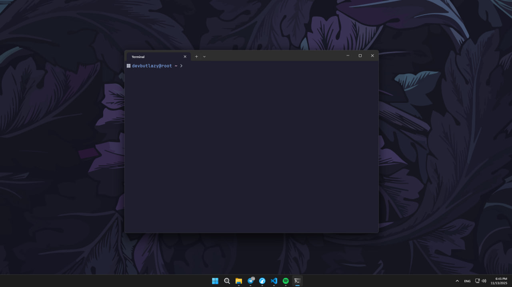
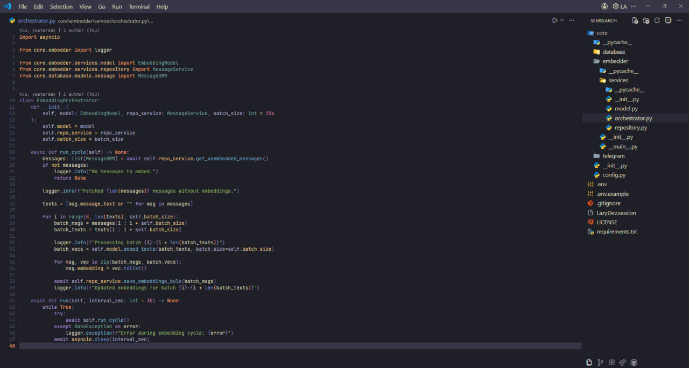
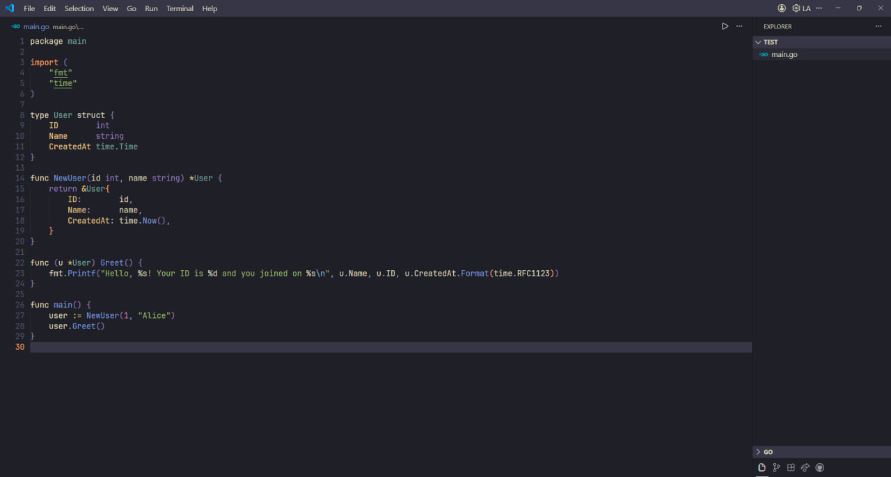
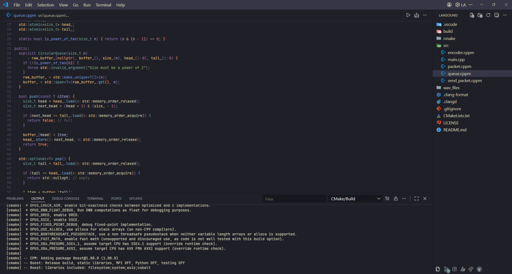

<h1 align="center"> LazyDev dotfiles</h1>





## VS Code</h1>




## 📂 Plugins
```
UI/UX:
- Kanagawa Flavors (Wave)  
- Material Icon Theme
- Apc Customize UI ++
- Better Comments
- Markdown All in One 
- Error Lens 

Python:
- Python 
- Python Debugger 
- Python Environments
- Pylance 
- Black Formater 
- Ruff

C/C++:
- C/C++
- clangd 
- CMakeTools 

Go:
- Go

Automations & Help:
- GitHub Actions 
- GitHub Pull Requests 
- GitLens
- Code runner
- Live Share
- SQLite Viewer
- YAML 
- Docker

Other:
- Discord Presence
- Polacode-2025 
```

## [settings.json](https://github.com/devbutlazy/dotfiles/tree/main/.config/vscode/settings.json) // [lazydev.code-profile](https://github.com/devbutlazy/dotfiles/tree/main/.config/vscode/lazydev.code-profile)


# >_ Terminal Installation


**Windows Terminal**  
Download and install: [Windows Terminal](https://github.com/microsoft/terminal)

**PowerShell**  
Download and install: [PowerShell](https://learn.microsoft.com/ru-ru/powershell/scripting/install/installing-powershell-on-windows)

**JetBrains Mono Font**  
Download and install: **[JetBrains Mono Font](https://www.jetbrains.com/lp/mono/)**

**Scoop Package Manager**  
Install Scoop if not already installed:
```powershell
iwr -useb get.scoop.sh | iex
```

---
## Configure Windows Terminal

Import my Windows Terminal settings: [settings.json](https://github.com/devbutlazy/dotfiles/blob/main/.config/wt/settings.json)
  
**Disable PowerShell greeting:**  
Open Windows Terminal settings → PowerShell profile → add flag:
```
--nologo
```

---
## Install Oh-My-Posh
```
scoop install https://github.com/JanDeDobbeleer/oh-my-posh/releases/latest/download/oh-my-posh.json

# Add Oh-My-Posh to PATH:

$env:Path += ";C:\Users\YOUR_USER\AppData\Local\Programs\oh-my-posh\bin"
```

---
## Install Utilities
[GNU Core Utilities for Windows](https://gnuwin32.sourceforge.net/packages/coreutils.htm)
```
# Install Fastfetch and copy my configuration
scoop install fastfetch
C:\Users\<Username>\.config\fastfetch\config.conf

# Enhanced ls – eza
scoop install eza

# Enhanced cat – bat
scoop install bat
```

---
## Configure Aliases and Oh-My-Posh
```
# Edit PowerShell profile
notepad $profile

# Aliases
Set-Alias -Name ls -Value eza
Set-Alias -Name cat -Value bat
Set-Alias -Name neofetch -Value fastfetch

# Oh-My-Posh init
oh-my-posh init pwsh --config 'https://raw.githubusercontent.com/JanDeDobbeleer/oh-my-posh/refs/heads/main/themes/catppuccin_mocha.omp.json' | Invoke-Expression
```

---
## Test Installation
```
# Restart PowerShell / Windows Terminal.
# Try out:
ls
cat $PROFILE
neofetch
```
---
## ✍️ Notes

Ensure fonts are applied correctly in *Windows Terminal → Settings → Appearance → Font*. If using virtual machines, enable **GPU acceleration** for better terminal performance.  
**Optional:** Customize fastfetch and Oh-My-Posh themes as desired.
